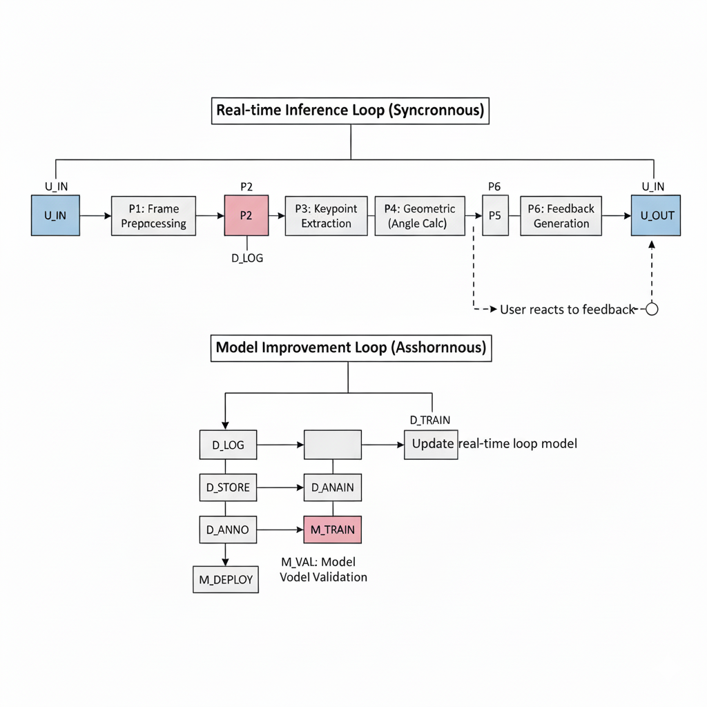

# FitForm-Live-Project
Microsoft AI School Cohort 8, First Team Project(20251111 ~ 20251121)

## 📌 Summary

-   🎯 Master your Form **Prevent Injury** and **Be Healthy**.
-   🤔 **Why** this project exists
    -   🚧 The Reality Beginners Face : Most beginners struggle to learn proper exercise form. 
    -   📣 Pain Points : Injury Risk, Lack of Feedback, Financial Burden, Lack of Motivation
-   🚀 **How** we solved it
    -   🛠️ Unified pipeline that combines **OpenCV VideoCapture**, **Pose Estimation Model**, and **Azure**.
    -   🖼️ Provide Real-Time Pose Analysis, Immediate Form Feedback, Personalized Coaching.

## 👀 How does it work?

## ⚙️ Pipeline

  
  
  
  
  

## 🧑🏻‍💻 Developers

  <table align="center">
    <tr>
      <td align="center"></td>
      <td align="center"></td>
      <td align="center"></td>
      <td align="center"></td> 
    </tr>
    <tr>
      <td align="center"><a href="https://github.com/bauhaus-k">김태훈</a></td>
      <td align="center"><a href="https://github.com/henryeffel">고영후</a></td>
      <td align="center"><a href="https://github.com/medori9999">이재웅</a></td>
      <td align="center"><a href="https://github.com/15nayana1021">허진호</a></td>   
    </tr>
    <tr>
      <td align="center" style="min-width: 220px;">
        
Project Management

        
Presentation design

        
Demo video

      </td>
      <td align="center" style="min-width: 220px;">
        
Architecture design

        
Server integration

        
UI/UX

      </td>
      <td align="center" style="min-width: 220px;">
        
Pose Model

        
Code integration

        
Gradio

      </td>
      <td align="center" style="min-width: 220px;">
        
Pose Model

        
Data preprocessing

        
Azure Custom Vision

      </td>
    </tr>
  </table>

